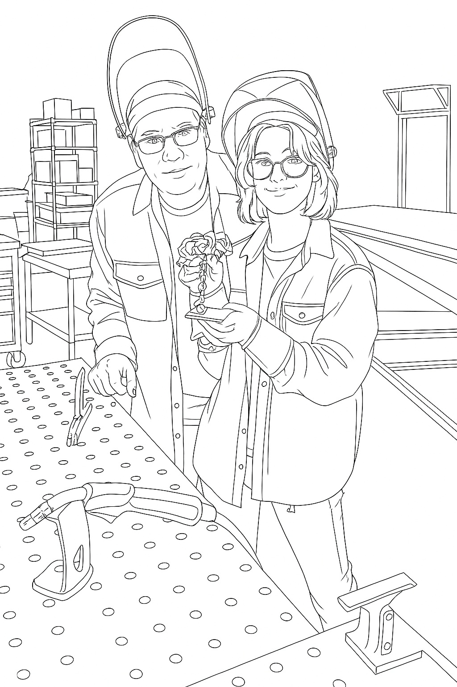
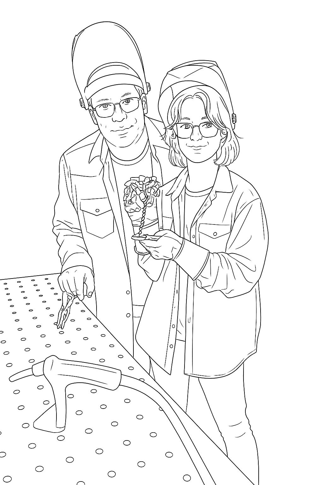

# victor

Victor converts photographs into precise vectorized line drawings optimized for laser cutting. Using AI-generated line art and potrace-based vectorization, it produces SVG files with strategically placed gaps that reduce heat buildup and improve cut quality on laser cutters.

## Reference

Video tutorial: https://youtu.be/sr7_2wMDuvc?si=RhvJienuw7z5LJh0

## Examples

### Original Image

*Original photograph to be processed*

### With Background Elements

*AI-generated line drawing with simplified background elements (walls, furniture, equipment)*


*Vectorized SVG with gaps inserted for laser cutting optimization*

### Without Background Elements

*AI-generated line drawing with subjects only, no background*


*Vectorized SVG with gaps inserted for laser cutting optimization*

## AI Prompts for Line Art Generation

✅ chatGPT PROMPT A — WITH BACKGROUND<hr>
Create a precise black-and-white line drawing of the subjects in the attached photo.

Use a single uniform line width for the entire drawing.
Lines must be clean, smooth, continuous, and free of sketchiness.
Do not use shading, gradients, textures, stippling, or hatching.
Use only solid black lines on a white background.

Reconstruct the subjects with accurate proportions and correct perspective.
Maintain the same camera angle and orientation as the photo.
Ensure the entire subject fits inside the frame; zoom out slightly if needed.
Include important structural edges such as clothing seams, helmets, glasses, gloves, hands, tools, and table surfaces.

Include simplified background elements drawn with the same uniform line weight.
Draw only large, clear shapes such as walls, doors, windows, shelving, tables, and major equipment.
Do not draw small clutter, fine objects, shadows, or texture details.

Output resolution must be between 4096 and 7680 pixels for sharp, high-resolution contour lines.
The final result should be a clean, consistent technical line drawing suitable for vectorization.


✅ chatGPT PROMPT B — WITHOUT BACKGROUND<hr>
Create a precise black-and-white line drawing of the subjects in the attached photo.

Use a single uniform line width for all lines in the drawing.
Lines must be clean, smooth, continuous, and must not appear sketchy.
Do not use shading, gradients, textures, stippling, or hatching.
Use only solid black lines on a white background.

Reconstruct the subjects with accurate proportions and correct perspective.
Maintain the same camera angle and orientation as the photo.
Ensure the entire subject fits inside the frame; zoom out slightly if needed.
Include important structural edges such as clothing seams, helmets, glasses, gloves, hands, tools, and objects the subjects are touching or holding.

Do not draw any background elements.
Do not include walls, doors, furniture, machinery, shelving, room edges, shadows, or any objects that are not directly connected to the subjects.
Leave the background completely blank and white.

Output resolution must be between 4096 and 7680 pixels for crisp, high-resolution contour lines.
The final result should be a clean, consistent technical line drawing suitable for vectorization.

## Usage Examples

### Vectorize with background:
```bash
python vectorize_fast.py \
    --input image-with.png \
    --output image-with.svg \
    --gap-length 20 \
    --gap-spacing 400 \
    --stroke-width 1.0
```

### Vectorize without background:
```bash
python vectorize_fast.py \
    --input image-without.png \
    --output image-without.svg \
    --gap-length 20 \
    --gap-spacing 400 \
    --stroke-width 1.0
```
